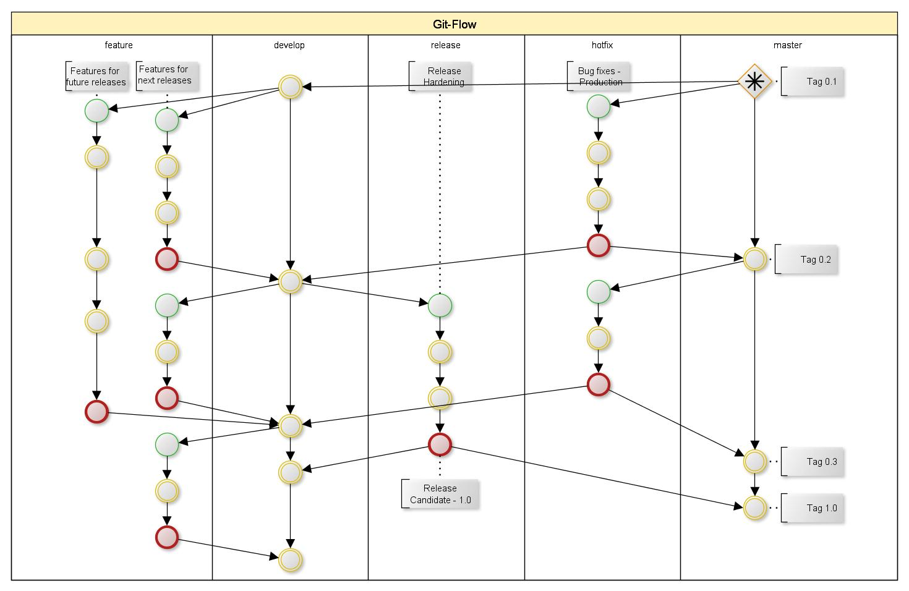

# DEVELOPER_GUIDE

## 목차

* Remote 2개 설정하기
  * CLI로 설정하기
  * Intellij에서 설정하기
* Author 변경하기
  * CLI에서 변경하기
  * Intellij에서 변경하기
* Branch 규약
  * Branch 이름 규칙
  * Issue & Pull Request 정책

## Remote 2개 설정하기

### CLI로 설정하기

1. 저장소 복제하기

```bash
git clone https://github.com/AIDataUnit/aiip-runtime-root.git
cd aiip-runtime-root
```

2. 현재 remote 설정 보기

```bash
$ git remote -v
origin  https://github.com/AIDataUnit/aiip-runtime-root.git (fetch)
origin  https://github.com/AIDataUnit/aiip-runtime-root.git (push)
```

3. 2개 Remote를 구분하기 위해 별도 이름으로 생성하기

```bash
# Alias: github & mygit
git remote add github https://github.com/AIDataUnit/aiip-runtime-root.git
git remote add mygit https://<username-idNumber>@mygit.skcc.com/scm/aiip/aiip-runtime-root.git

# 2개 모두 연결할 `all` remote 추가
git remote add all https://github.com/AIDataUnit/aiip-runtime-root.git
```

4. `all` remote에 URL 2개 추가하기: github & mygit

```bash
git remote set-url --add --push all https://github.com/AIDataUnit/aiip-runtime-root.git
git remote set-url --add --push all https://<username-idNumber>@mygit.skcc.com/scm/aiip/aiip-runtime-root.git
```

5. 설정 확인하기

```console
$ git remote show all
* remote all
  Fetch URL: https://github.com/AIDataUnit/aiip-runtime-root.git  # <- Your original remote
  Push  URL: https://github.com/AIDataUnit/aiip-runtime-root.git  # <- Your original remote
  Push  URL: https://<username-ex)09255>@mygit.skcc.com/scm/aiip/aiip-runtime-root.git  # <- An alternative remote
  HEAD branch: master
  Remote branch:
    master new (next fetch will store in remotes/all)
  Local ref configured for 'git push':
    main pushes to master (up to date)
```

6. 사용하기

remote branch 보기:

```bash
git branch -r
```


`git pull`: 한 번에 하나씩.

```bash
git pull mygit develop # --allow-unrelated-histories
git pull github develop
```

`git fetch` 동시에 가져오기 가능.

```bash
git fetch --all
```

`git push` 동시에 push 가능(`all` branch에 2개 추가해 놨으므로).

```bash
git push all

# with submodules: recursive push
git push all --recurse-submodules=on-demand
```


[참고](https://github.com/pydemia/git-multi-remote-and-submodule#multi-remote-config-1-local-n-remote-management)

### Intellij에서 설정하기

#### Remote 추가하기

**VCS** > **Git** > **Remotes...**


#### Pull

*한 번에 하나씩 가능  
**VCS** > **Git** > **Pull...**


#### Fetch

*동시에 가져오기 가능  
**VCS** > **Git** > **Fetch...**

#### Push

*한 번에 하나씩 가능  
**VCS** > **Git** > **Push...**


## Author 변경하기

### CLI에서 변경하기

> :warning: 주의사항
> 아래 방식은 git 세팅을 변경하므로, github remote에 푸쉬하려면 별도 인증이 필요함.
> github에 ID/PW 방식을 사용하고 있었다면 사용 상 별다른 변경 내용 없음.

사용자 정보 확인: https://mygit.skcc.com/profile

* 전체 Repository에 적용(`${HOME}/.gitconfig`)

```bash
git config --global user.name "ㅇㅇㅇ(xxx)/ㅇㅇㅇ/ㅇㅇ"
git config --global user.email "ㅇㅇㅇ@SKCC.COM"
```

* 개별 Repository에 적용(`${REPO_HOME}/.git/config`)

```bash
git config --local user.name "ㅇㅇㅇ(xxx)/ㅇㅇㅇ/ㅇㅇ"
git config --local user.email "ㅇㅇㅇ@SKCC.COM"
```

### Intellij에서 변경하기


## Branch 규약

예시


### Branch 이름 규칙


기본 Branch

* `develop`: 개발을 위한 기본 Branch. Stable/UnStable 모두 포괄 가능.
* `release/<version>`: 배포 Branch. `develop`에서 분화하여 버전 별로 구분하기 위한 Branch.
* `master(main)`: 최신 Stable 버전을 유지하기 위한 Branch

개발자 생성 Branch(by Issue)

* 일반 기능개발: `feature/${project}/${number}`
* Hotfix: `hotfix/${project}/${number}`(merge to `develop`)
* Bugfix: `bugfix/${project}/${number}`(merge to `release`)

### Issue & Pull Request 정책

* 모든 commit은 `master(main)`, `develop`, `release`에 직접 하지 않고, Pull Request를 통해서 작업한다.

* 모든 작업은 Issue에 등록하고, 각 commit은 우선 해당 Issue를 참조하여 생성한 Branch에 push한다.  
  Issue에 포함된 작업이 완료되면, 최종 commit 이후 `develop`에 Pull Request를 생성하고, Reviewer를 추가한다.
  Issue의 `Linked Pull Requests`에 해당 Pull Request를 연결한다.

* 모든 Pull Request는 1인 이상의 Review를 받아야 Merge 가능하다.
* 최종 Merge가 끝난 후, Issue를 종료한다. 작업이 끝난 Branch는 주기적으로 삭제한다.

#### Issue 등록하기


#### Intellij에서 Issue 가져오기

1. Branch 이름 기본 포맷 설정하기

**Files** > **Settings**


> :bulb: Feature branch name format 설명
> `feature`: 고정 String(주로 쓰일 항목이라 feature로 선택)
> `${project}`: Intellij에 열려 있는 Project명
> `${number}`: Issue 번호

2. Task Server 추가하기

**Tools** > **Tasks & Contexts** > **Configure Servers...**


3. Task 열기(Issue로 Branch 만들기)

* Issue 선택하기
**Tools** > **Tasks & Contexts** > **Open Tasks...**


* Branch 만들기(기본값으로 설정한 `feature`와 from `develop` 변경 가능)
> :bulb: 변경 시 Guide
> `feature`: from `develop`
> `hotfix`: from `develop`
> `bugfix`: from `release/<>`


#### Pull Request 등록하기

Github Pull Requests 활용
